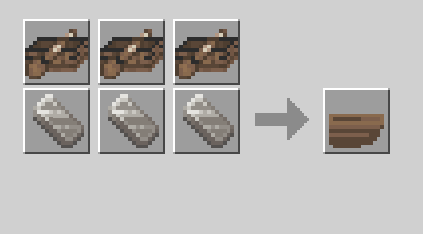
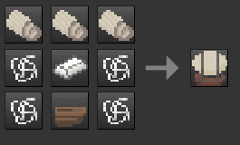

[]

# sum_airship

Mod for [Luanti](https://luanti.org). You can download it from the in-game content manager, or [ContentDB](https://content.luanti.org/packages/Sumianvoice/sum_airship/).

This mod adds an airship to Minetest. It should work in most games, but only Minetest Game, MineClone (VoxeLibre) and RePixture are supported for crafting recipes. Games based on those may still have crafting if they use the same items. Other games are not because the mod doesn't know what each game calls each item or node. Although, it shouldn't crash no matter what game you use, this is only for crafting recipes.

**Controls:** Flies like a boat, WSAD controls with the addition of jump for up, sneak for down, and aux1 (sprint) to dismount. Does not require fuel but will go faster when given any type of coal.

### Crafting

#### MineClon\* (VoxeLibre)

All items: wool: 27, string: 4, wood: 15, iron_ingot: 4
9 Wool -> Canvas
3 Boats & 3 Iron Ingots -> Hull
3 Canvas, 1 Hull, 4 String & 1 Iron ingot -> Airship

#### Minetest Game

All items: wool: 27, string: 4, wood: 15, iron_ingot: 4
9 Wool -> Canvas
3 Boats & 3 Iron Ingots -> Hull
3 Canvas, 1 Hull, 4 String & 1 Iron ingot -> Airship

#### RePixture

All items: wool: 27, fiber: 8, wood: varies depending on boat type, steel_ingot: 4
9 group:fuzzy (wool or cotton bale) -> Canvas
3 Boats & 3 Steel Ingots -> Hull
3 Canvas, 1 Hull, 8 Fiber, 1 Steel Ingot -> Airship

### Air Currents

This optionally uses [sum_air_currents](https://content.luanti.org/packages/Sumianvoice/sum_air_currents/) to apply force based on the weather.
