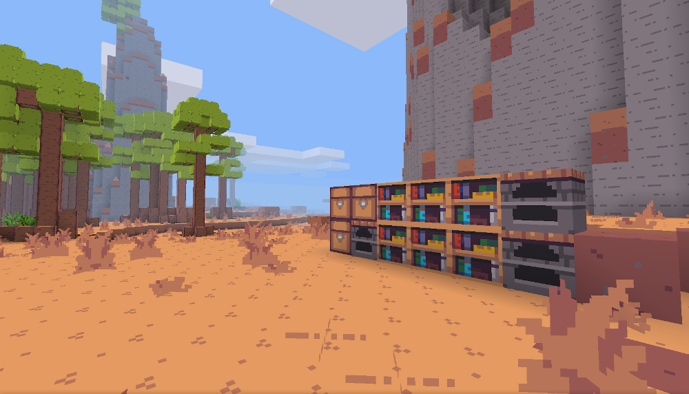

# Soothing 32

Lightweight yet aesthetically pleasing texture pack for Minetest. Seriously, it could run on a toaster! :bread:  
The texture pack is 32 colours only, more exactly the ones in the [Zughy32 palette](https://lospec.com/palette-list/zughy-32).

  

  

### Official supported mods
* Baked Clay (no ornated patterns)
* Beds
* Bones
* Bucket
* Carts
* Default
* Doors
* Flowers
* NextGen Bows
* player_api
* Wool
* X-Decor-libre (chess only)

### Submitted by contributors (that maybe someday I'll tweak)
* (partly) 3D Armor (Giov4)
* Butterflies (tinnéh)
* Dye (tinnéh)
* Fire (tinnéh)
* Fireflies (tinnéh)
* (partly) Mesecons (Giov4)
* Screwdriver (tinnéh)
* Stairs (tinnéh)
* Tnt (tinnéh)
* Vessels (tinnéh)
* Xpanes (tinnéh)

---

#### RE: Why can't I contribute?
Contributions are currently closed and they'll probably remain like so. I already manage enough projects to also review your pixel arts, and I'm fine with the amount of mods Soothing 32 supports. If you feel the urge to add more mods, please fork it :P
